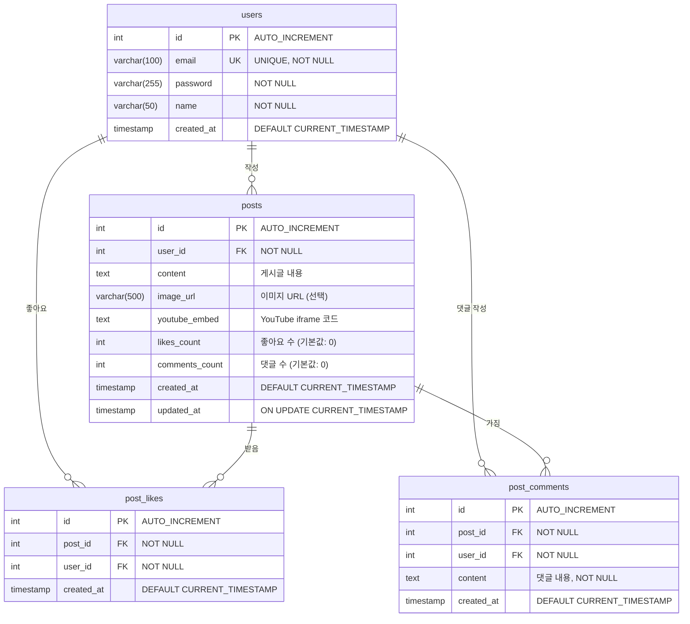

# 2025MusicShare 데이터베이스 ERD

## Entity Relationship Diagram



## 테이블 상세 설명

### 1. users (사용자)
- **목적**: 회원 정보 저장
- **주요 필드**:
  - `id`: 사용자 고유 ID (Primary Key)
  - `email`: 이메일 (로그인 ID, Unique)
  - `password`: bcrypt 암호화된 비밀번호
  - `name`: 사용자 이름 (게시글/댓글 표시용)

### 2. posts (게시글)
- **목적**: 사용자가 작성한 게시글 저장
- **주요 필드**:
  - `id`: 게시글 고유 ID (Primary Key)
  - `user_id`: 작성자 ID (Foreign Key → users.id)
  - `content`: 게시글 본문 (최대 2000자)
  - `image_url`: 첨부 이미지 URL (선택 사항)
  - `youtube_embed`: YouTube iframe 소스 코드 (선택 사항)
  - `likes_count`: 좋아요 개수 (캐싱용)
  - `comments_count`: 댓글 개수 (캐싱용)
  - `updated_at`: 수정 시간 (자동 갱신)

### 3. post_likes (게시글 좋아요)
- **목적**: 사용자의 게시글 좋아요 기록
- **주요 필드**:
  - `id`: 좋아요 고유 ID (Primary Key)
  - `post_id`: 게시글 ID (Foreign Key → posts.id)
  - `user_id`: 사용자 ID (Foreign Key → users.id)
- **제약조건**: 
  - UNIQUE(post_id, user_id) - 한 사용자당 게시글 1개만 좋아요 가능

### 4. post_comments (게시글 댓글)
- **목적**: 게시글에 달린 댓글 저장
- **주요 필드**:
  - `id`: 댓글 고유 ID (Primary Key)
  - `post_id`: 게시글 ID (Foreign Key → posts.id)
  - `user_id`: 작성자 ID (Foreign Key → users.id)
  - `content`: 댓글 내용

## 관계 (Relationships)

### 1. users → posts (1:N)
- 한 사용자는 여러 게시글을 작성할 수 있음
- `posts.user_id` → `users.id`
- **ON DELETE CASCADE**: 사용자 삭제 시 해당 사용자의 모든 게시글 삭제

### 2. users → post_likes (1:N)
- 한 사용자는 여러 게시글에 좋아요를 할 수 있음
- `post_likes.user_id` → `users.id`
- **ON DELETE CASCADE**: 사용자 삭제 시 해당 사용자의 모든 좋아요 삭제

### 3. users → post_comments (1:N)
- 한 사용자는 여러 댓글을 작성할 수 있음
- `post_comments.user_id` → `users.id`
- **ON DELETE CASCADE**: 사용자 삭제 시 해당 사용자의 모든 댓글 삭제

### 4. posts → post_likes (1:N)
- 한 게시글은 여러 좋아요를 받을 수 있음
- `post_likes.post_id` → `posts.id`
- **ON DELETE CASCADE**: 게시글 삭제 시 해당 게시글의 모든 좋아요 삭제

### 5. posts → post_comments (1:N)
- 한 게시글은 여러 댓글을 가질 수 있음
- `post_comments.post_id` → `posts.id`
- **ON DELETE CASCADE**: 게시글 삭제 시 해당 게시글의 모든 댓글 삭제

## 인덱스 (Indexes)

### Primary Keys
- `users.id`
- `posts.id`
- `post_likes.id`
- `post_comments.id`

### Foreign Keys (자동 인덱스 생성)
- `posts.user_id`
- `post_likes.post_id`
- `post_likes.user_id`
- `post_comments.post_id`
- `post_comments.user_id`

### Unique Constraints
- `users.email` (Unique Index)
- `post_likes(post_id, user_id)` (Composite Unique Index)

### Performance Indexes
- `posts.created_at` (최신순 정렬용)
- `post_comments.post_id` (게시글별 댓글 조회용)

## 데이터 무결성 규칙

### CASCADE 규칙
```sql
-- 사용자 삭제 시
DELETE FROM users WHERE id = ?
→ posts 자동 삭제
→ post_likes 자동 삭제  
→ post_comments 자동 삭제

-- 게시글 삭제 시
DELETE FROM posts WHERE id = ?
→ post_likes 자동 삭제
→ post_comments 자동 삭제
```

### COUNT 동기화
```sql
-- 좋아요 추가/삭제 시
UPDATE posts 
SET likes_count = (SELECT COUNT(*) FROM post_likes WHERE post_id = ?)
WHERE id = ?

-- 댓글 추가/삭제 시
UPDATE posts 
SET comments_count = (SELECT COUNT(*) FROM post_comments WHERE post_id = ?)
WHERE id = ?
```

## 데이터베이스 생성 스크립트

```sql
-- 데이터베이스 생성
CREATE DATABASE IF NOT EXISTS musicshare 
CHARACTER SET utf8mb4 
COLLATE utf8mb4_unicode_ci;

USE musicshare;

-- users 테이블
CREATE TABLE users (
    id INT AUTO_INCREMENT PRIMARY KEY,
    email VARCHAR(100) NOT NULL UNIQUE,
    password VARCHAR(255) NOT NULL,
    name VARCHAR(50) NOT NULL,
    created_at TIMESTAMP DEFAULT CURRENT_TIMESTAMP,
    INDEX idx_email (email)
) ENGINE=InnoDB DEFAULT CHARSET=utf8mb4 COLLATE=utf8mb4_unicode_ci;

-- posts 테이블
CREATE TABLE posts (
    id INT AUTO_INCREMENT PRIMARY KEY,
    user_id INT NOT NULL,
    content TEXT,
    image_url VARCHAR(500),
    youtube_embed TEXT,
    likes_count INT DEFAULT 0,
    comments_count INT DEFAULT 0,
    created_at TIMESTAMP DEFAULT CURRENT_TIMESTAMP,
    updated_at TIMESTAMP DEFAULT CURRENT_TIMESTAMP ON UPDATE CURRENT_TIMESTAMP,
    FOREIGN KEY (user_id) REFERENCES users(id) ON DELETE CASCADE,
    INDEX idx_user_id (user_id),
    INDEX idx_created_at (created_at)
) ENGINE=InnoDB DEFAULT CHARSET=utf8mb4 COLLATE=utf8mb4_unicode_ci;

-- post_likes 테이블
CREATE TABLE post_likes (
    id INT AUTO_INCREMENT PRIMARY KEY,
    post_id INT NOT NULL,
    user_id INT NOT NULL,
    created_at TIMESTAMP DEFAULT CURRENT_TIMESTAMP,
    FOREIGN KEY (post_id) REFERENCES posts(id) ON DELETE CASCADE,
    FOREIGN KEY (user_id) REFERENCES users(id) ON DELETE CASCADE,
    UNIQUE KEY unique_post_user (post_id, user_id),
    INDEX idx_post_id (post_id),
    INDEX idx_user_id (user_id)
) ENGINE=InnoDB DEFAULT CHARSET=utf8mb4 COLLATE=utf8mb4_unicode_ci;

-- post_comments 테이블
CREATE TABLE post_comments (
    id INT AUTO_INCREMENT PRIMARY KEY,
    post_id INT NOT NULL,
    user_id INT NOT NULL,
    content TEXT NOT NULL,
    created_at TIMESTAMP DEFAULT CURRENT_TIMESTAMP,
    FOREIGN KEY (post_id) REFERENCES posts(id) ON DELETE CASCADE,
    FOREIGN KEY (user_id) REFERENCES users(id) ON DELETE CASCADE,
    INDEX idx_post_id (post_id),
    INDEX idx_user_id (user_id)
) ENGINE=InnoDB DEFAULT CHARSET=utf8mb4 COLLATE=utf8mb4_unicode_ci;
```

## 통계 정보

### 테이블 개수
- **총 4개 테이블**: users, posts, post_likes, post_comments

### 관계 개수
- **총 5개 관계**: 모두 1:N 관계

### 외래 키 제약조건
- **총 5개**: 모두 ON DELETE CASCADE 설정

### 인덱스 개수
- **Primary Keys**: 4개
- **Unique Keys**: 2개 (users.email, post_likes 복합키)
- **Foreign Key Indexes**: 5개
- **Performance Indexes**: 2개

---

**작성일**: 2025년 11월 19일  
**데이터베이스**: MySQL 8.0  
**문자셋**: utf8mb4_unicode_ci
